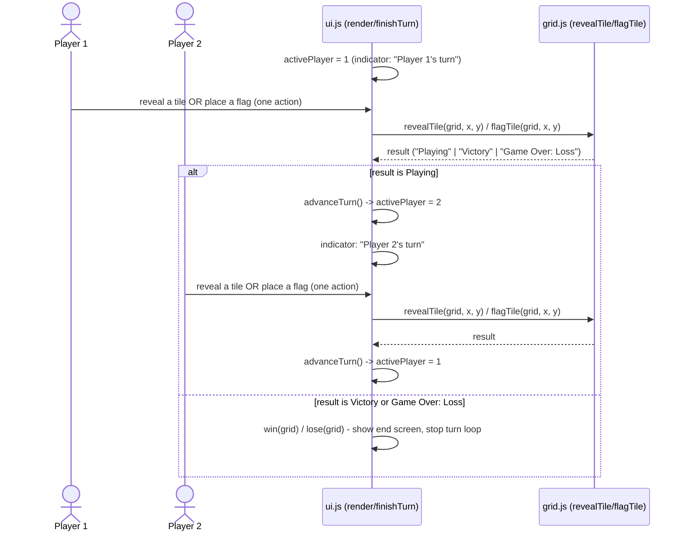
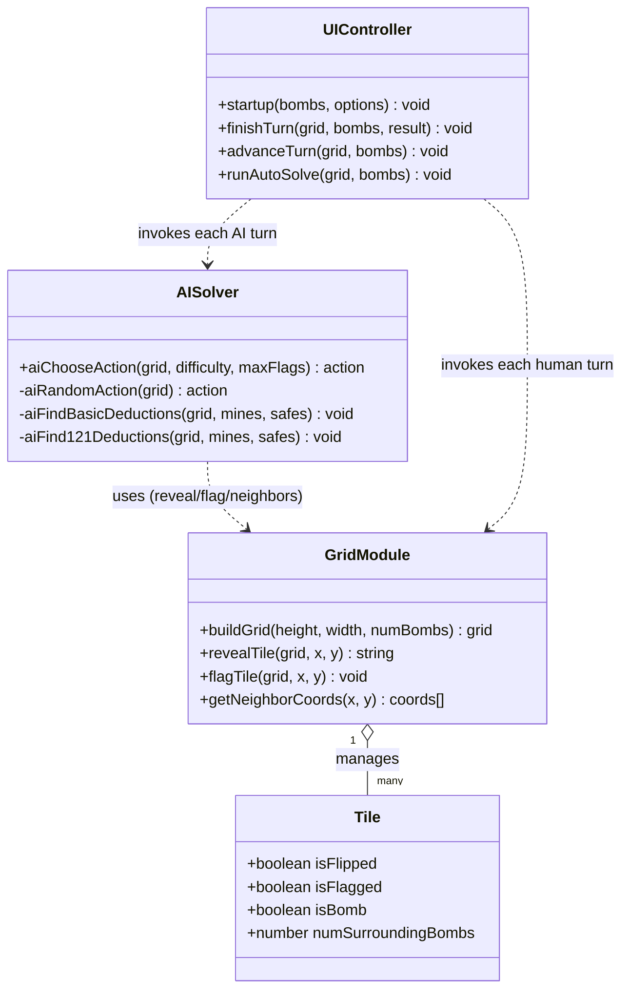

# Software-Engineering-II-Project-1

## Project 1: Minesweeper

### Description
This program allows the user to play the popular Minesweeper game, from their web browser.  To win the game, the user must uncover all of the tiles without uncovering a tile with a hidden mine beneath it.  The numbers on flipped tiles indicate the number of mines hidden under the 8 tiles immediately surrounding it.

### Installation
First, `git clone` this project’s repository onto your local machine–-no additional installation is required.  Using file explorer, navigate to the location where you downloaded the project, and open the HTML document with the web browser of your choice.  You will be brought to the main screen to begin the game.

### How to Play
Enter the number of mines to be hidden underneath tiles on the gameboard.  Once the board appears, select tiles to uncover, using the number that appears on the flipped tile to aid in your gameplay strategy.  If a tile with a mine hidden beneath it is flipped, the user loses the game.

### Creators
See the `TeamMembers.txt` document for more information on the contributors for this program.  All Team Meeting Logs and other documentation are included for reference.

### More Information
Please see the Software Architecture document for more detailed information regarding data flow, more detailed game play logic, and how this project was designed.

## Project 2: Maintenance & Extension

This repository was forked and extended by a new maintenance team (see `TeamMembers.txt`
for the original Project 1 authors) as part of an EECS 581/582-style
"inherit-and-extend" assignment. Work happened on the `team-extension-ai-multiplayer`
branch. The original Project 1 gameplay (setup, reveal, flag, win/lose) was verified
and the first-click behavior was improved: the selected tile and its neighbors are
kept mine-free, guaranteeing a zero-valued first reveal and a useful cascade. Mines
relocated out of that protected area also trigger `setTileNeighboringBombCounts(grid)`
so every displayed neighbor count remains accurate.

### AI Solver (`ai.js`)
Three difficulties, selectable from the start screen when "Vs AI" is chosen:
- **Easy** – reveals a random hidden, unflagged tile each turn.
- **Medium** – Easy, plus two deductions applied to every revealed numbered tile:
  1. If a tile's hidden-neighbor count equals its number, every hidden neighbor is a
     mine and gets flagged.
  2. If a tile's flagged-neighbor count equals its number, every remaining hidden
     neighbor is safe and gets opened.
- **Hard** – Medium, plus the **1-2-1 pattern**: three side-by-side revealed tiles
  reading 1-2-1 mean the two outer hidden neighbors are mines (flagged) and the
  inner hidden neighbor is safe (opened).

If no deduction applies, the AI falls back to a random reveal. "Vs AI" mode can run
**interactively** (you and the AI alternate turns) or in **auto-solve** (the AI plays
every turn by itself, useful for watching/demoing the solver).

### Custom Addition: Local 2-Player Multiplayer
"2 Player" and "Vs AI" share one board and alternate turns. Player 1 (red) goes first,
then Player 2 (blue) or the AI. Each turn is exactly ONE action: reveal one tile, or
place/remove one flag. Flags use the owner's sprite color, an opponent's flag cannot be
changed, and the page background fades to the active player's color.

Two win conditions can be chosen at the start screen:
- **Instant death** – whoever uncovers a mine loses immediately; clearing the board
  makes both sides winners.
- **Points** – uncovering a mine costs that player 3 points and play continues. Each
  flag on a real mine is worth 1 point, awarded once every safe tile is revealed. The
  highest score wins.

#### UML Sequence Diagram – Multiplayer Turn Alternation

#### UML Class Diagram – AI Solver

